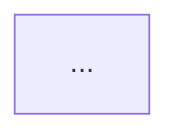

# Architecture & topology diagrams (C4 + Mermaid + Marp)

## What this skill is for

Turn a real system into an **honest, standards-anchored set of diagrams** and a
**shareable slide deck**, with the diagrams written as code (Mermaid) so they
live in git, diff as text, and render anywhere. The output is meant to be sent
to a partner, a reviewer, or a future maintainer — so the bar is *accuracy and
clarity*, not decoration.

Two products come out of one source:

- a Markdown deck (`*.topology.md`) with embedded Mermaid, **the source of truth**, and
- rendered `*.html` (present in a browser) + `*.pdf` (attach/email) via the build script.

## The non-negotiable first move: ground the diagram in reality

A diagram that looks plausible but doesn't match the running system is worse
than no diagram — it misleads the reader with authority. **Before drawing
anything, map the real system.** Read the bring-up path (compose files, the
`up`/`demo` scripts, the Makefile), enumerate the actual services + ports +
images, and trace the real data/control flow. Cite where each fact came from.
If a component is *simulated*, *stubbed*, *optional*, or *not yet wired*, it
**must be drawn that way** (see honesty rules below). When the system is large,
dispatch a read-only explore agent to return a structured topology map, then
draw from that map — don't reconstruct from memory.

The test: every box, port, and arrow in your diagram should be traceable to a
file or an observed fact. If you can't trace it, don't draw it as solid.

## The C4 model — pick the right altitude per slide

C4 (Context → Container → Component → Code) plus two supplementary views
(Deployment, Dynamic) is the recognized standard for describing software
architecture at controllable zoom levels. One diagram per altitude; never mix
levels on one slide (that's the most common way these become unreadable).

| Level | Question it answers | Use it when | Boxes are… |
|---|---|---|---|
| **1 — System Context** | Who/what uses the system, and what it talks to | Always (the opening slide) | the system + external people/systems |
| **2 — Container** | What deployable/running units make it up | Almost always | apps, services, datastores, proxies |
| **3 — Component** | What's inside one container | Only for a container worth zooming into | modules/handlers inside one service |
| **Deployment** | How containers map onto infra/hosts/networks | When topology *is* the point | nodes, hosts, networks, the proxy fan-out |
| **Dynamic / Runtime** | The step-by-step of one scenario | To show "how it runs" | a numbered sequence/flow |

For a "topology + how it runs" deck the usual spine is:
**Context → Container → Deployment → one or two Dynamic flows.** Read
`references/c4-model.md` for the per-level Mermaid syntax and worked examples.

## Diagram conventions (so the set reads as one voice)

Detail in `references/diagram-conventions.md`; the load-bearing rules:

- **Color = meaning, used sparingly.** Pick a tiny palette and make it mean
  something (e.g. always-on vs optional, real vs simulated, your-system vs
  external). Don't color for decoration — a reader will assume the color is
  semantic and be misled if it isn't.
- **Label every edge** with what flows and over what (`RTSP`, `gRPC`,
  `scrape /metrics`, `NGAP/SCTP`). An unlabeled arrow is a question, not an
  answer.
- **Honesty markers are mandatory.** Mark `(simulated)`, `(stub)`,
  `(optional)`, `(observer-mode)`, `(CPU-floor)` directly in the node label,
  and give them a distinct, muted style. A topology that draws a simulated
  PAWS authority identically to a real datastore is a lie of omission. This is
  the diagram-layer expression of the same honesty discipline good benchmark
  reporting uses: show what is real, refuse to imply what isn't.
- **One idea per slide.** If a slide needs a paragraph to explain the diagram,
  split it. Group related services into subgraphs rather than drawing 30 boxes.
- **Keep it grep-able and diffable.** Mermaid in fenced ```mermaid blocks;
  stable node IDs so a later edit is a small diff, not a rewrite.

## Slide format — Marp

Marp turns Markdown into slides. Source is plain Markdown with a small YAML
front-matter; `---` separates slides. Diagrams are ```mermaid fenced blocks.
See `references/slide-format.md` for the front-matter, the one-idea-per-slide
patterns, speaker notes, and the sharing checklist.

Skeleton:

```markdown
---
marp: true
theme: default
paginate: true
title: <System> — Architecture & Topology
---

# <System> — Architecture & Topology
<one-line what-this-is + date + commit>

---

## System context



---
... (one altitude per slide)
```

## Rendering + sharing — one command, graceful degradation

Use `scripts/build_slides.sh <deck.md>`. It mirrors a converter-ladder so it
works on a bare box and a fully-tooled one alike — and it never claims a PDF it
didn't produce:

1. Render Markdown → HTML with `marp` (or `npx @marp-team/marp-cli` if marp
   isn't installed). HTML needs no browser engine.
2. Inject a Mermaid bootstrap so the ```mermaid blocks render **client-side**
   when the HTML is opened in a browser — no local headless-Chrome needed just
   to view.
3. PDF: if `chromium`/`chrome` is present, headless-print the rendered HTML to
   PDF (this runs the JS, so diagrams appear). If not, print the exact
   "open the HTML and Save-as-PDF (Ctrl/Cmd-P)" instruction. **Empty/again is
   honest** — don't fabricate a PDF path that doesn't exist.

Then verify before claiming done: open the HTML, confirm each diagram rendered
(not a raw code block), and that the honesty markers are present. State plainly
what was produced (`HTML ✓`, `PDF ✓` or `PDF → Save-as in browser`).

**Sharing:** the HTML is self-contained-ish (Mermaid via CDN — needs network on
first open) and the PDF is fully portable. For a partner who must read offline
with no network, produce the PDF (chromium path) or pre-render diagrams to
inline SVG. Note the network dependency when you hand it over.

## What "done" means

1. Every box/port/arrow traces to a real file or observed fact (grounded).
2. Diagrams are at the right C4 altitude, one idea per slide.
3. Simulated/stub/optional/observer-mode components are visibly marked.
4. `build_slides.sh` produced the HTML (and PDF, or the honest Save-as path).
5. You opened the HTML and confirmed the diagrams render and markers show.
6. You stated what was produced and any sharing caveat (network for CDN).

## Reference files

- `references/c4-model.md` — the five views, when to use each, Mermaid per level, worked examples.
- `references/diagram-conventions.md` — palette, edge labels, honesty markers, subgraph grouping, anti-patterns.
- `references/slide-format.md` — Marp front-matter, slide patterns, the render path, the sharing checklist.
