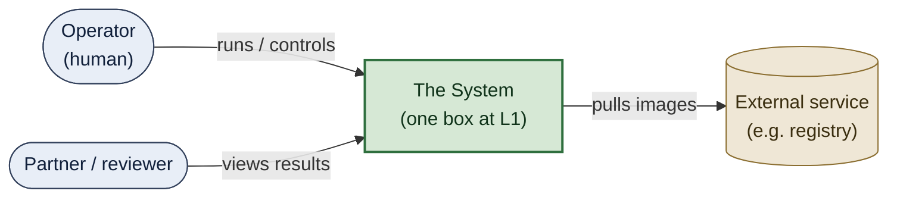
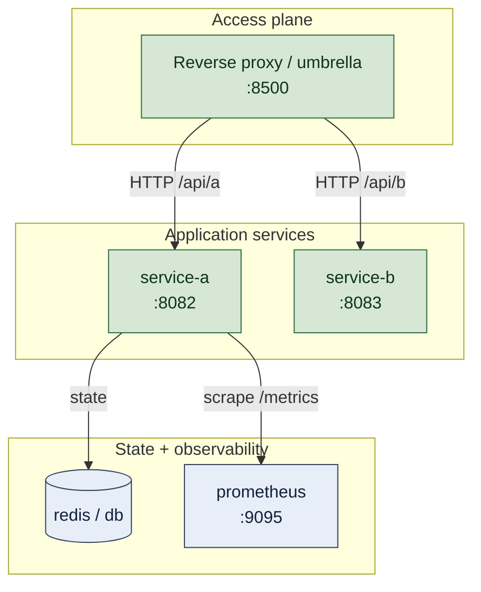
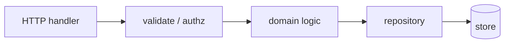
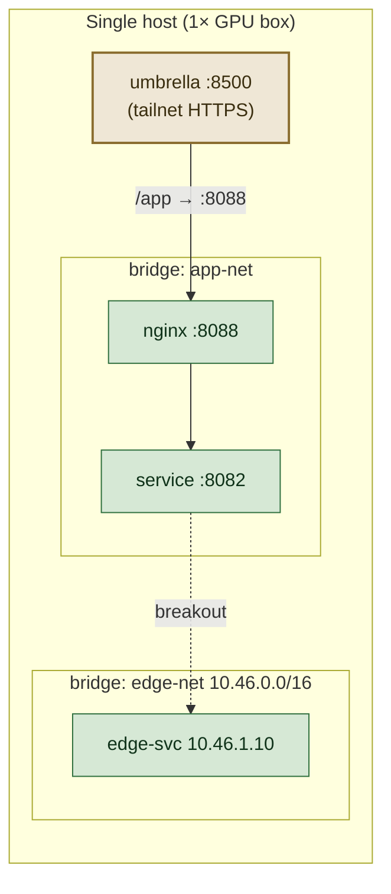
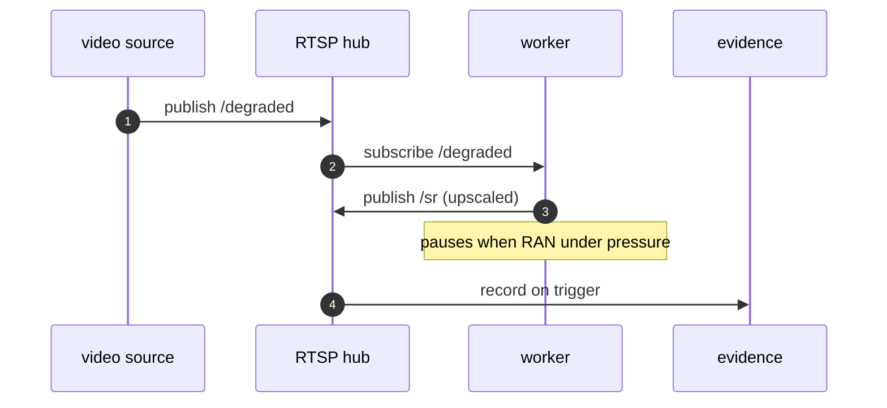

# The C4 model — views, altitude, and Mermaid

C4 (by Simon Brown) describes software architecture at four nested zoom levels
plus two supplementary views. The discipline is **one level per diagram**: a
reader can always tell what altitude they're looking at, and you never force
them to hold two scales in their head at once.

## Table of contents
- [The five views](#the-five-views)
- [Level 1 — System Context](#level-1--system-context)
- [Level 2 — Container](#level-2--container)
- [Level 3 — Component](#level-3--component)
- [Deployment view](#deployment-view)
- [Dynamic / runtime view](#dynamic--runtime-view)
- [Choosing the spine for a deck](#choosing-the-spine-for-a-deck)

## The five views

| View | Audience | Shows | Hides |
|---|---|---|---|
| Context (L1) | everyone | the system as one box + who/what it talks to | all internals |
| Container (L2) | technical | the running/deployable units + how they talk | code-level detail |
| Component (L3) | developers of one container | modules inside one container | other containers |
| Deployment | ops/SRE | how containers map to infra, hosts, networks | application logic |
| Dynamic | everyone | the ordered steps of one scenario | everything not in that scenario |

Most decks need Context + Container + Deployment + one or two Dynamic flows.
Component (L3) is only worth drawing for a container complex enough to deserve
its own zoom — don't draw it for every service.

## Level 1 — System Context

The system is a single box. Around it: the people (actors) and external
systems it interacts with. No internals. This is the slide that orients a
reader who has never seen the system.

## Level 2 — Container

Each deployable/running unit is a box: services, datastores, proxies, batch
jobs. Edges are labeled with protocol + purpose. Group related units in
subgraphs. This is the workhorse slide.

## Level 3 — Component

Inside ONE container: its modules/handlers and how a request flows through
them. Only draw this for a container that earns the zoom.

## Deployment view

How containers land on real infrastructure: hosts, networks, the proxy
fan-out, which ports are exposed where. Use subgraphs for hosts/networks.
This is the view where *topology is the point* — the reverse-proxy sub-path
fan-out, the localhost-vs-tailnet duality, the per-subnet edge networks.

## Dynamic / runtime view

One scenario, numbered steps. A `sequenceDiagram` is best when ordering and
request/response matter; a numbered `flowchart` when it's a pipeline. This is
the "how it runs" slide.

## Choosing the spine for a deck

- **"Show me the system"** → Context + Container.
- **"Show me how it's deployed / the topology"** → add Deployment.
- **"Show me how it runs / the flow"** → add one or two Dynamic views.
- **"Explain this one hairy service"** → add a Component view for it only.

Resist the urge to draw all five for every system. The right deck is the
fewest views that let the reader build a correct mental model.
