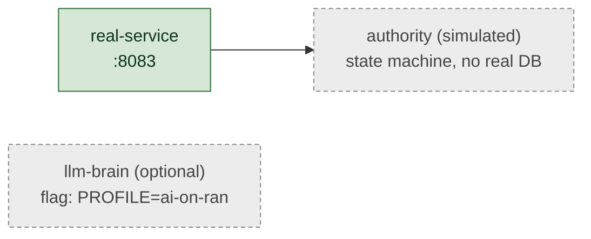

# Diagram conventions

Conventions that make a diagram set read as one deliberate voice rather than
a pile of boxes. Consistency is what lets a reader trust the diagram.

## The governing aesthetic — minimalist, zen, in service of the story

Before any rule below: a diagram earns its place by *telling one beat of the
story* with the fewest marks possible. The reader should *see* the idea before
they read a single label. Aim for calm, not complete.

- **Fewest marks that carry the idea.** If a box doesn't change the reader's
  understanding, cut it. A slide with 5 well-chosen boxes teaches more than one
  with 30. Detail belongs in a linked table/doc, not on the slide.
- **Whitespace is a feature, not waste.** Let diagrams breathe — generous
  spacing reads as confidence; density reads as anxiety.
- **Calm palette, thin strokes, soft fills.** Muted tones over saturated ones;
  one quiet accent for the thing that matters. The eye should rest, then follow.
- **Each slide advances one story beat.** A topology deck is a narrative
  (why → what → how it's deployed → how it runs → what's honest → how to run
  it), not a reference dump. If a slide doesn't move the story, drop it.
- **Abstract to the right grain.** A 30-service system becomes 4 planes; zoom
  into a plane only when the story needs it. The full table lives in an
  appendix/doc you link to.

These are not in tension with accuracy — a minimal diagram is still grounded;
it just shows the load-bearing truth and routes the long tail elsewhere.

## Palette — color = meaning, used sparingly

Pick a *small* palette (3–5 classes) and make every color mean something. A
reader assumes color is semantic; if you color for decoration they will infer
meaning that isn't there. Define the classes once and reuse the same `classDef`
names across every diagram in the deck.

A proven scheme for topology decks:

| Class | Meaning | Suggested fill / stroke |
|---|---|---|
| `sys` / `svc` | your system / always-on service | green `#d6e8d5` / `#2f6f3e` |
| `ext` | external system you don't own | sand `#efe7d6` / `#8a6d2f` |
| `actor` | a human / external caller | blue `#e8eef7` / `#33415c` |
| `store` | datastore / observability sink | blue-grey `#e8eef7` / `#33415c` |
| `sim` | **simulated / stub / optional / observer-mode** | muted/hatched grey `#ececec` / `#888`, dashed stroke |

Always include a one-line legend slide or an inline legend so the palette is
self-documenting for someone who opens the PDF cold.

## Edge labels — every arrow says what flows

An unlabeled edge is a question. Label with **what** + **how**:

- `HTTP /api/mode`, `gRPC`, `RTSP /sr`, `scrape /metrics`, `NGAP/SCTP`,
  `Redis pub/sub`, `pulls image`.
- Use solid edges for primary/required flows, dashed (`-.->`) for
  optional/conditional/control flows. State the convention on the legend.

## Honesty markers — mandatory

The fastest way to lose a technical reader's trust is to draw something
aspirational as if it's real. Mark reality in the node label *and* style:

- `(simulated)` — e.g. a simulated regulatory authority / a CSV-replay feed.
- `(stub)` — interface exists, implementation is a placeholder.
- `(optional)` — only present under a flag/overlay; say which.
- `(observer-mode)` — wraps/observes but is not the active dataplane.
- `(CPU-floor)` — degraded fallback vs the real (e.g. GPU) path.

Give all of these the `sim` class (muted, dashed) so a reader scanning the
diagram immediately sees what is and isn't load-bearing. If most of a diagram
is muted, that itself is the honest message.

## Grouping — subgraphs over box-soup

Beyond ~8–10 boxes a flat diagram becomes unreadable. Group into subgraphs by
plane/network/responsibility (`Access plane`, `Application`, `State + obs`,
`edge-net 10.46.x`). A reader navigates groups, not 30 nodes.

## Stable IDs — diffable diagrams

Give nodes short stable IDs (`mc` for mode-controller, `sr` for sr-worker) so a
later edit to one label is a one-line diff, not a re-layout. Keep IDs out of the
visible label; put the human name in the `["..."]` text.

## Anti-patterns

| Smell | Fix |
|---|---|
| 30 boxes, no groups | subgraph by plane/network |
| Unlabeled arrows | label what + protocol |
| Color with no meaning | adopt the semantic palette or drop color |
| Two C4 levels on one slide | split into two slides |
| Simulated drawn like real | apply the `sim` class + label |
| A paragraph explaining the diagram | the diagram is at the wrong altitude; zoom out or split |
| Mermaid that only renders in one tool | stick to core flowchart/sequence syntax |
