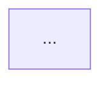

# Slide format — Marp + Mermaid

Marp renders Markdown to slides. The source is plain Markdown with a YAML
front-matter block; `---` on its own line is a slide break. Diagrams are
```mermaid fenced blocks. The source `.md` is the artifact you commit and
diff; HTML/PDF are generated.

## Front-matter

```markdown
---
marp: true
theme: default        # default | gaia | uncover, or a custom CSS theme
paginate: true        # page numbers
title: <System> — Architecture & Topology
footer: "<system> · <commit-short> · <date>"
---
```

Useful per-deck directives (right after front-matter or per slide with
`<!-- _class: ... -->`):

- `<!-- _paginate: false -->` on the title slide.
- `style: |` block in front-matter for small CSS tweaks (e.g. shrink Mermaid:
  `section svg { max-height: 78vh; }`).

## Slide patterns

**Title slide** — name, one-line what-this-is, the date + commit so a reader
knows how fresh it is (a stale topology slide is a trap).

**One idea per slide.** A slide is a diagram + a title + at most a few bullets.
If you're writing a paragraph, the diagram is at the wrong altitude — split it.

**Diagram slide:**
```markdown
## Deployment topology


```

**Legend slide** (once, early): the palette and edge conventions, so the PDF is
self-documenting.

**Ledger/table slide** for the honest maturity view (what's real vs
simulated/stub/optional) — a table reads better than cramming markers into one
diagram.

**Speaker notes:** HTML comments become presenter notes:
```markdown
<!-- Note: mention the umbrella strips the /wg3 prefix before proxying. -->
```

## Rendering — the build script

`scripts/build_slides.sh <deck.md> [out_dir]` does:

1. **Resolve a renderer:** prefer an installed `marp`; else `npx
   @marp-team/marp-cli` (downloads on first use; needs node/npx). The script
   passes `--html` so raw HTML / the Mermaid bootstrap is allowed.
2. **HTML:** always produced (no browser engine needed). The script injects a
   small Mermaid bootstrap before `</body>` that finds the rendered
   ```mermaid code blocks and runs `mermaid` (from CDN) on them, so the
   diagrams appear when the HTML is opened in a browser.
3. **PDF:** if `chromium`/`chromium-browser`/`google-chrome` is present, the
   script headless-prints the *rendered HTML* to PDF (the JS runs first, so the
   diagrams are in the PDF). If no browser is found, it prints the exact
   "open the HTML and Save-as-PDF (Ctrl/Cmd-P)" instruction and produces no
   PDF — it never fabricates one.

This converter-ladder is deliberate: it works on a bare box (HTML only) and a
fully-tooled box (HTML + PDF) without you changing anything, and it is honest
about what it could and couldn't produce.

## Verify before claiming done

- Open the HTML in a browser; confirm each ```mermaid block rendered as a
  diagram (not a raw code listing). A common failure is a Mermaid syntax error
  in one diagram — Mermaid shows an error box for that diagram only; fix the
  syntax and re-render.
- Confirm the honesty markers (`sim` class) are visible.
- Report exactly what exists: `HTML ✓`, and either `PDF ✓` or
  `PDF → open HTML and Save-as-PDF (no headless browser on this host)`.

## Sharing checklist

- **PDF** is the portable share (email/attach) — fully self-contained once the
  chromium path produced it.
- **HTML** needs network on first open (Mermaid loads from CDN). If the
  recipient is offline, send the PDF, or pre-render diagrams to inline SVG.
- State the freshness: which commit / date the topology reflects.
- If the deck shows a partner's or third party's system, treat it as you would
  any outward-facing artifact — confirm there's nothing in it (tokens,
  internal hostnames, IPs) that shouldn't leave the building before you send.
